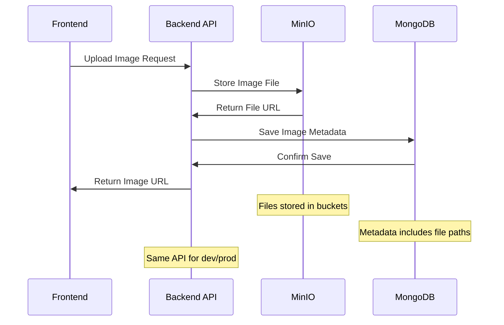

# MinIO Integration Guide

## Overview

MinIO serves as the local S3-compatible object storage solution for the Restaurant Developer platform during development. It provides a lightweight, high-performance alternative to AWS S3 that enables developers to test file upload, storage, and retrieval functionality without requiring cloud services or incurring costs.

### Purpose and Role
- **Local Development Storage**: S3-compatible API for development and testing
- **Menu Image Storage**: Handles restaurant menu item images and gallery photos
- **File Upload Testing**: Enables testing of file upload workflows locally
- **Development Environment**: Provides consistent storage API across environments
- **Cost-Effective Development**: Eliminates cloud storage costs during development

### Key Features Utilized
- S3-compatible API (fully compatible with AWS SDK)
- Web-based management console
- Multi-bucket support for organizing different file types
- Docker container deployment for easy setup
- Persistent storage through volume mounting
- High-performance object storage with minimal resource usage

### Integration Points
- **AWS S3 SDK**: Uses same SDK for both development and production
- **File Upload APIs**: Backend file upload endpoints
- **Image Processing**: Menu item image storage and retrieval
- **Docker Compose**: Integrated into development environment setup
- **Production Migration**: Seamless transition to DigitalOcean Spaces

## Setup & Configuration

### Environment Variables

```bash
# MinIO Configuration (Development Only)
MINIO_ENDPOINT=127.0.0.1
MINIO_PORT=9000
MINIO_ACCESS_KEY=minioadmin
MINIO_SECRET_KEY=minioadmin
MINIO_BUCKET=restaurant-menu-images
MINIO_USE_SSL=false

# Alternative configuration with custom credentials
MINIO_ROOT_USER=restaurant_dev
MINIO_ROOT_PASSWORD=secure_dev_password_123

# Storage configuration
MINIO_DATA_DIR=./data/minio
MINIO_CONSOLE_PORT=9001
```

### Docker Compose Setup

#### Basic MinIO Configuration
```yaml
# docker-compose.yml
version: '3.8'

services:
  minio:
    image: minio/minio:latest
    container_name: restaurant_minio
    ports:
      - "9000:9000"  # API endpoint
      - "9001:9001"  # Web console
    environment:
      MINIO_ROOT_USER: restaurant_dev
      MINIO_ROOT_PASSWORD: secure_dev_password_123
    volumes:
      - ./data/minio:/data
    command: server /data --console-address ":9001"
    healthcheck:
      test: ["CMD", "curl", "-f", "http://localhost:9000/minio/health/live"]
      interval: 30s
      timeout: 20s
      retries: 3
    networks:
      - restaurant_network

  # MinIO Client for initial setup
  minio-setup:
    image: minio/mc:latest
    container_name: restaurant_minio_setup
    depends_on:
      minio:
        condition: service_healthy
    environment:
      MINIO_ROOT_USER: restaurant_dev
      MINIO_ROOT_PASSWORD: secure_dev_password_123
    entrypoint: >
      /bin/sh -c "
      mc alias set myminio http://minio:9000 restaurant_dev secure_dev_password_123;
      mc mb myminio/restaurant-menu-images --ignore-existing;
      mc mb myminio/restaurant-logos --ignore-existing;
      mc mb myminio/restaurant-gallery --ignore-existing;
      mc mb myminio/user-avatars --ignore-existing;
      echo 'MinIO buckets created successfully';
      "
    networks:
      - restaurant_network

networks:
  restaurant_network:
    driver: bridge
```

#### Advanced Configuration with Health Checks
```yaml
# docker-compose.dev.yml - Enhanced development setup
version: '3.8'

services:
  minio:
    image: minio/minio:latest
    container_name: restaurant_minio
    ports:
      - "9000:9000"
      - "9001:9001"
    environment:
      MINIO_ROOT_USER: ${MINIO_ROOT_USER:-restaurant_dev}
      MINIO_ROOT_PASSWORD: ${MINIO_ROOT_PASSWORD:-secure_dev_password_123}
      MINIO_DOMAIN: localhost:9000  # For virtual-host-style URLs
    volumes:
      - minio_data:/data
      - ./scripts/minio-init.sh:/docker-entrypoint-initdb.d/minio-init.sh
    command: server /data --console-address ":9001"
    healthcheck:
      test: ["CMD", "curl", "-f", "http://localhost:9000/minio/health/live"]
      interval: 10s
      timeout: 5s
      retries: 5
      start_period: 30s
    restart: unless-stopped
    networks:
      - restaurant_network

volumes:
  minio_data:
    driver: local

networks:
  restaurant_network:
    external: true
```

### Initial Setup Scripts

#### Automated Bucket Creation
```bash
#!/bin/bash
# scripts/minio-init.sh - Initialize MinIO with required buckets

set -e

# Wait for MinIO to be ready
until curl -f http://localhost:9000/minio/health/live; do
    echo "Waiting for MinIO to be ready..."
    sleep 2
done

# Configure MinIO client
mc alias set local http://localhost:9000 ${MINIO_ROOT_USER} ${MINIO_ROOT_PASSWORD}

# Create buckets
echo "Creating MinIO buckets..."
mc mb local/restaurant-menu-images --ignore-existing
mc mb local/restaurant-logos --ignore-existing  
mc mb local/restaurant-gallery --ignore-existing
mc mb local/user-avatars --ignore-existing
mc mb local/temp-uploads --ignore-existing

# Set bucket policies (public read for images)
mc anonymous set public local/restaurant-menu-images
mc anonymous set public local/restaurant-logos
mc anonymous set public local/restaurant-gallery

# Upload sample images if available
if [ -d "./sample-data/images" ]; then
    echo "Uploading sample images..."
    mc cp --recursive ./sample-data/images/* local/restaurant-menu-images/
fi

echo "MinIO initialization completed successfully!"
```

### Development vs Production Configuration

#### Development Setup (MinIO)
```javascript
// backend/config/storage.js
const AWS = require('aws-sdk');

const createStorageClient = () => {
  if (process.env.NODE_ENV === 'development') {
    // MinIO configuration for development
    return new AWS.S3({
      endpoint: `http://${process.env.MINIO_ENDPOINT}:${process.env.MINIO_PORT}`,
      accessKeyId: process.env.MINIO_ACCESS_KEY,
      secretAccessKey: process.env.MINIO_SECRET_KEY,
      s3ForcePathStyle: true, // Required for MinIO
      signatureVersion: 'v4',
      sslEnabled: false
    });
  } else {
    // Production configuration (DigitalOcean Spaces)
    return new AWS.S3({
      endpoint: process.env.DO_SPACES_ENDPOINT,
      accessKeyId: process.env.DO_SPACES_KEY,
      secretAccessKey: process.env.DO_SPACES_SECRET,
      s3ForcePathStyle: false,
      signatureVersion: 'v4'
    });
  }
};

module.exports = createStorageClient;
```

#### Environment-Specific Configuration
```javascript
// backend/config/environments.js
const storageConfig = {
  development: {
    endpoint: `http://${process.env.MINIO_ENDPOINT}:${process.env.MINIO_PORT}`,
    accessKeyId: process.env.MINIO_ACCESS_KEY,
    secretAccessKey: process.env.MINIO_SECRET_KEY,
    bucket: process.env.MINIO_BUCKET,
    region: 'us-east-1', // MinIO default
    s3ForcePathStyle: true,
    sslEnabled: false
  },
  production: {
    endpoint: process.env.DO_SPACES_ENDPOINT,
    accessKeyId: process.env.DO_SPACES_KEY,
    secretAccessKey: process.env.DO_SPACES_SECRET,
    bucket: process.env.DO_SPACES_BUCKET,
    region: process.env.DO_SPACES_REGION || 'nyc3',
    s3ForcePathStyle: false,
    sslEnabled: true
  }
};

module.exports = storageConfig[process.env.NODE_ENV] || storageConfig.development;
```

## API Reference

### S3-Compatible Operations

#### File Upload
```javascript
// backend/services/storageService.js
const AWS = require('aws-sdk');
const storageConfig = require('../config/storage');

class StorageService {
  constructor() {
    this.s3 = new AWS.S3(storageConfig);
    this.bucket = storageConfig.bucket;
  }

  // Upload file to MinIO/S3
  async uploadFile(fileBuffer, fileName, contentType, options = {}) {
    try {
      const params = {
        Bucket: this.bucket,
        Key: fileName,
        Body: fileBuffer,
        ContentType: contentType,
        ACL: options.public ? 'public-read' : 'private',
        Metadata: options.metadata || {}
      };

      const result = await this.s3.upload(params).promise();
      
      return {
        success: true,
        url: result.Location,
        key: result.Key,
        etag: result.ETag
      };
    } catch (error) {
      console.error('File upload error:', error);
      throw new Error(`Upload failed: ${error.message}`);
    }
  }

  // Upload with progress tracking
  async uploadWithProgress(fileBuffer, fileName, contentType, progressCallback) {
    try {
      const params = {
        Bucket: this.bucket,
        Key: fileName,
        Body: fileBuffer,
        ContentType: contentType,
        ACL: 'public-read'
      };

      const upload = this.s3.upload(params);
      
      // Track upload progress
      upload.on('httpUploadProgress', (progress) => {
        const percentage = Math.round((progress.loaded / progress.total) * 100);
        if (progressCallback) {
          progressCallback(percentage, progress);
        }
      });

      const result = await upload.promise();
      return result;
    } catch (error) {
      console.error('Upload with progress error:', error);
      throw error;
    }
  }

  // Generate presigned URL for direct uploads
  async generatePresignedUrl(fileName, contentType, expiresIn = 3600) {
    try {
      const params = {
        Bucket: this.bucket,
        Key: fileName,
        ContentType: contentType,
        Expires: expiresIn,
        ACL: 'public-read'
      };

      const url = await this.s3.getSignedUrlPromise('putObject', params);
      return url;
    } catch (error) {
      console.error('Presigned URL generation error:', error);
      throw error;
    }
  }
}

module.exports = StorageService;
```

#### File Management Operations
```javascript
// Extended StorageService methods
class StorageService {
  // ... previous methods

  // List files in bucket
  async listFiles(prefix = '', maxKeys = 1000) {
    try {
      const params = {
        Bucket: this.bucket,
        Prefix: prefix,
        MaxKeys: maxKeys
      };

      const result = await this.s3.listObjectsV2(params).promise();
      
      return {
        files: result.Contents.map(obj => ({
          key: obj.Key,
          size: obj.Size,
          lastModified: obj.LastModified,
          etag: obj.ETag
        })),
        hasMore: result.IsTruncated,
        nextToken: result.NextContinuationToken
      };
    } catch (error) {
      console.error('List files error:', error);
      throw error;
    }
  }

  // Get file metadata
  async getFileInfo(fileName) {
    try {
      const params = {
        Bucket: this.bucket,
        Key: fileName
      };

      const result = await this.s3.headObject(params).promise();
      
      return {
        contentType: result.ContentType,
        contentLength: result.ContentLength,
        lastModified: result.LastModified,
        etag: result.ETag,
        metadata: result.Metadata
      };
    } catch (error) {
      if (error.code === 'NotFound') {
        return null;
      }
      console.error('Get file info error:', error);
      throw error;
    }
  }

  // Delete file
  async deleteFile(fileName) {
    try {
      const params = {
        Bucket: this.bucket,
        Key: fileName
      };

      await this.s3.deleteObject(params).promise();
      return { success: true };
    } catch (error) {
      console.error('Delete file error:', error);
      throw error;
    }
  }

  // Copy file within bucket
  async copyFile(sourceKey, destinationKey) {
    try {
      const params = {
        Bucket: this.bucket,
        CopySource: `${this.bucket}/${sourceKey}`,
        Key: destinationKey
      };

      const result = await this.s3.copyObject(params).promise();
      return result;
    } catch (error) {
      console.error('Copy file error:', error);
      throw error;
    }
  }

  // Generate download URL
  async generateDownloadUrl(fileName, expiresIn = 3600) {
    try {
      const params = {
        Bucket: this.bucket,
        Key: fileName,
        Expires: expiresIn
      };

      const url = await this.s3.getSignedUrlPromise('getObject', params);
      return url;
    } catch (error) {
      console.error('Download URL generation error:', error);
      throw error;
    }
  }
}
```

### MinIO Client (MC) Operations

#### Command Line Interface
```bash
# Basic MinIO Client operations

# Configure alias
mc alias set local http://localhost:9000 restaurant_dev secure_dev_password_123

# List buckets
mc ls local

# List files in bucket
mc ls local/restaurant-menu-images

# Upload file
mc cp ./menu-item.jpg local/restaurant-menu-images/

# Download file
mc cp local/restaurant-menu-images/menu-item.jpg ./downloads/

# Remove file
mc rm local/restaurant-menu-images/old-image.jpg

# Sync directory
mc mirror ./local-images/ local/restaurant-menu-images/ --overwrite

# Set bucket policy
mc anonymous set public local/restaurant-menu-images

# Get file info
mc stat local/restaurant-menu-images/menu-item.jpg
```

#### Batch Operations Script
```bash
#!/bin/bash
# scripts/minio-batch-operations.sh

ALIAS="local"
BUCKET="restaurant-menu-images"

# Function to upload multiple files
upload_batch() {
    local source_dir=$1
    local target_prefix=$2
    
    echo "Uploading files from $source_dir to $ALIAS/$BUCKET/$target_prefix"
    
    for file in "$source_dir"/*; do
        if [ -f "$file" ]; then
            filename=$(basename "$file")
            mc cp "$file" "$ALIAS/$BUCKET/$target_prefix/$filename"
            echo "Uploaded: $filename"
        fi
    done
}

# Function to create backup
create_backup() {
    local backup_name="backup-$(date +%Y%m%d-%H%M%S)"
    echo "Creating backup: $backup_name"
    
    mc mirror "$ALIAS/$BUCKET" "$ALIAS/backups/$backup_name" --overwrite
    echo "Backup created successfully"
}

# Usage examples
case "$1" in
    "upload")
        upload_batch "$2" "$3"
        ;;
    "backup")
        create_backup
        ;;
    *)
        echo "Usage: $0 {upload|backup} [source_dir] [target_prefix]"
        ;;
esac
```

## Implementation Examples

### File Upload API Endpoint

```javascript
// backend/routes/upload.js
const express = require('express');
const multer = require('multer');
const StorageService = require('../services/storageService');
const { authenticateUser } = require('../middleware/auth');
const router = express.Router();

// Configure multer for memory storage
const upload = multer({
  storage: multer.memoryStorage(),
  limits: {
    fileSize: 10 * 1024 * 1024, // 10MB limit
  },
  fileFilter: (req, file, cb) => {
    // Only allow images
    if (file.mimetype.startsWith('image/')) {
      cb(null, true);
    } else {
      cb(new Error('Only image files are allowed'), false);
    }
  }
});

const storageService = new StorageService();

// Upload menu item image
router.post('/menu-image', authenticateUser, upload.single('image'), async (req, res) => {
  try {
    if (!req.file) {
      return res.status(400).json({ error: 'No file uploaded' });
    }

    const { restaurantId, menuItemId } = req.body;
    
    // Generate unique filename
    const timestamp = Date.now();
    const fileExtension = req.file.originalname.split('.').pop();
    const fileName = `menu-items/${restaurantId}/${menuItemId}/${timestamp}.${fileExtension}`;

    // Upload to MinIO/S3
    const result = await storageService.uploadFile(
      req.file.buffer,
      fileName,
      req.file.mimetype,
      { 
        public: true,
        metadata: {
          'original-name': req.file.originalname,
          'restaurant-id': restaurantId,
          'menu-item-id': menuItemId,
          'uploaded-by': req.user._id.toString()
        }
      }
    );

    res.json({
      success: true,
      url: result.url,
      key: result.key,
      fileName: req.file.originalname
    });
  } catch (error) {
    console.error('Menu image upload error:', error);
    res.status(500).json({ 
      error: 'Upload failed',
      message: error.message 
    });
  }
});

// Upload restaurant logo
router.post('/restaurant-logo', authenticateUser, upload.single('logo'), async (req, res) => {
  try {
    if (!req.file) {
      return res.status(400).json({ error: 'No file uploaded' });
    }

    const { restaurantId } = req.body;
    
    // Validate restaurant ownership
    if (req.user.restaurants.indexOf(restaurantId) === -1) {
      return res.status(403).json({ error: 'Unauthorized' });
    }

    const timestamp = Date.now();
    const fileExtension = req.file.originalname.split('.').pop();
    const fileName = `restaurants/${restaurantId}/logo/${timestamp}.${fileExtension}`;

    const result = await storageService.uploadFile(
      req.file.buffer,
      fileName,
      req.file.mimetype,
      { public: true }
    );

    res.json({
      success: true,
      url: result.url,
      key: result.key
    });
  } catch (error) {
    console.error('Restaurant logo upload error:', error);
    res.status(500).json({ 
      error: 'Upload failed',
      message: error.message 
    });
  }
});

// Generate presigned URL for direct upload
router.post('/presigned-url', authenticateUser, async (req, res) => {
  try {
    const { fileName, contentType, category } = req.body;
    
    if (!fileName || !contentType) {
      return res.status(400).json({ error: 'fileName and contentType required' });
    }

    // Generate secure filename
    const timestamp = Date.now();
    const fileExtension = fileName.split('.').pop();
    const secureFileName = `${category || 'uploads'}/${req.user._id}/${timestamp}.${fileExtension}`;

    const presignedUrl = await storageService.generatePresignedUrl(
      secureFileName,
      contentType,
      300 // 5 minutes
    );

    res.json({
      uploadUrl: presignedUrl,
      fileName: secureFileName,
      expiresIn: 300
    });
  } catch (error) {
    console.error('Presigned URL generation error:', error);
    res.status(500).json({ 
      error: 'Failed to generate upload URL',
      message: error.message 
    });
  }
});

module.exports = router;
```

### Frontend File Upload Component

```javascript
// frontend/components/ImageUpload.jsx
import React, { useState, useCallback } from 'react';
import { useDropzone } from 'react-dropzone';
import { uploadMenuImage } from '../services/api';

const ImageUpload = ({ restaurantId, menuItemId, onUploadComplete }) => {
  const [uploading, setUploading] = useState(false);
  const [uploadProgress, setUploadProgress] = useState(0);
  const [uploadedImages, setUploadedImages] = useState([]);

  const onDrop = useCallback(async (acceptedFiles) => {
    setUploading(true);
    setUploadProgress(0);

    try {
      for (const file of acceptedFiles) {
        const formData = new FormData();
        formData.append('image', file);
        formData.append('restaurantId', restaurantId);
        formData.append('menuItemId', menuItemId);

        const result = await uploadMenuImage(formData, (progress) => {
          setUploadProgress(progress);
        });

        setUploadedImages(prev => [...prev, {
          url: result.url,
          key: result.key,
          fileName: result.fileName
        }]);
      }

      if (onUploadComplete) {
        onUploadComplete(uploadedImages);
      }
    } catch (error) {
      console.error('Upload error:', error);
      alert('Upload failed: ' + error.message);
    } finally {
      setUploading(false);
      setUploadProgress(0);
    }
  }, [restaurantId, menuItemId, onUploadComplete, uploadedImages]);

  const { getRootProps, getInputProps, isDragActive } = useDropzone({
    onDrop,
    accept: {
      'image/*': ['.jpeg', '.jpg', '.png', '.gif', '.webp']
    },
    maxSize: 10 * 1024 * 1024, // 10MB
    disabled: uploading
  });

  return (
    <div className="image-upload">
      <div 
        {...getRootProps()} 
        className={`dropzone ${isDragActive ? 'active' : ''} ${uploading ? 'uploading' : ''}`}
      >
        <input {...getInputProps()} />
        {uploading ? (
          <div className="upload-progress">
            <div className="progress-bar">
              <div 
                className="progress-fill" 
                style={{ width: `${uploadProgress}%` }}
              ></div>
            </div>
            <p>Uploading... {uploadProgress}%</p>
          </div>
        ) : (
          <div className="upload-prompt">
            {isDragActive ? (
              <p>Drop the images here...</p>
            ) : (
              <p>Drag & drop images here, or click to select files</p>
            )}
          </div>
        )}
      </div>

      {uploadedImages.length > 0 && (
        <div className="uploaded-images">
          <h4>Uploaded Images</h4>
          <div className="image-grid">
            {uploadedImages.map((image, index) => (
              <div key={index} className="uploaded-image">
                
                <p>{image.fileName}</p>
              </div>
            ))}
          </div>
        </div>
      )}
    </div>
  );
};

export default ImageUpload;
```

### API Service Functions

```javascript
// frontend/services/api.js
import axios from 'axios';

const API_BASE_URL = process.env.REACT_APP_API_URL || 'http://localhost:3550';

// Create axios instance with auth
const api = axios.create({
  baseURL: API_BASE_URL,
  headers: {
    'Content-Type': 'application/json'
  }
});

// Add auth token to requests
api.interceptors.request.use((config) => {
  const token = localStorage.getItem('auth_token');
  if (token) {
    config.headers.Authorization = `Bearer ${token}`;
  }
  return config;
});

// Upload menu image with progress
export const uploadMenuImage = async (formData, onProgress) => {
  try {
    const response = await api.post('/upload/menu-image', formData, {
      headers: {
        'Content-Type': 'multipart/form-data'
      },
      onUploadProgress: (progressEvent) => {
        const progress = Math.round(
          (progressEvent.loaded * 100) / progressEvent.total
        );
        if (onProgress) {
          onProgress(progress);
        }
      }
    });

    return response.data;
  } catch (error) {
    throw new Error(error.response?.data?.message || 'Upload failed');
  }
};

// Upload restaurant logo
export const uploadRestaurantLogo = async (formData, restaurantId) => {
  try {
    const data = new FormData();
    data.append('logo', formData.get('logo'));
    data.append('restaurantId', restaurantId);

    const response = await api.post('/upload/restaurant-logo', data, {
      headers: {
        'Content-Type': 'multipart/form-data'
      }
    });

    return response.data;
  } catch (error) {
    throw new Error(error.response?.data?.message || 'Logo upload failed');
  }
};

// Get presigned URL for direct upload
export const getPresignedUrl = async (fileName, contentType, category) => {
  try {
    const response = await api.post('/upload/presigned-url', {
      fileName,
      contentType,
      category
    });

    return response.data;
  } catch (error) {
    throw new Error(error.response?.data?.message || 'Failed to get upload URL');
  }
};

// Direct upload to presigned URL
export const uploadToPresignedUrl = async (presignedUrl, file, onProgress) => {
  try {
    const response = await axios.put(presignedUrl, file, {
      headers: {
        'Content-Type': file.type
      },
      onUploadProgress: (progressEvent) => {
        const progress = Math.round(
          (progressEvent.loaded * 100) / progressEvent.total
        );
        if (onProgress) {
          onProgress(progress);
        }
      }
    });

    return response;
  } catch (error) {
    throw new Error('Direct upload failed');
  }
};
```

## Integration with Restaurant Developer

### Data Flow Architecture



### Development Workflow Integration

#### Docker Compose Integration
```yaml
# docker-compose.dev.yml - Full development stack
version: '3.8'

services:
  # Backend API
  backend:
    build: ./backend
    ports:
      - "3550:3550"
    environment:
      - NODE_ENV=development
      - MONGODB_URI=mongodb://mongo:27017/restaurant_developer
      - MINIO_ENDPOINT=minio
      - MINIO_PORT=9000
      - MINIO_ACCESS_KEY=restaurant_dev
      - MINIO_SECRET_KEY=secure_dev_password_123
    depends_on:
      - mongo
      - minio
    networks:
      - restaurant_network

  # Frontend
  frontend:
    build: ./frontend
    ports:
      - "3000:3000"
    environment:
      - REACT_APP_API_URL=http://localhost:3550
    depends_on:
      - backend
    networks:
      - restaurant_network

  # MongoDB
  mongo:
    image: mongo:7
    ports:
      - "27017:27017"
    volumes:
      - mongo_data:/data/db
    networks:
      - restaurant_network

  # MinIO
  minio:
    image: minio/minio:latest
    ports:
      - "9000:9000"
      - "9001:9001"
    environment:
      MINIO_ROOT_USER: restaurant_dev
      MINIO_ROOT_PASSWORD: secure_dev_password_123
    volumes:
      - minio_data:/data
    command: server /data --console-address ":9001"
    healthcheck:
      test: ["CMD", "curl", "-f", "http://localhost:9000/minio/health/live"]
      interval: 30s
      timeout: 20s
      retries: 3
    networks:
      - restaurant_network

volumes:
  mongo_data:
  minio_data:

networks:
  restaurant_network:
    driver: bridge
```

#### Environment-Specific Storage Configuration
```javascript
// backend/config/storage.js - Unified storage configuration
const AWS = require('aws-sdk');

class StorageManager {
  constructor() {
    this.config = this.getStorageConfig();
    this.client = this.createClient();
  }

  getStorageConfig() {
    const env = process.env.NODE_ENV || 'development';
    
    const configs = {
      development: {
        endpoint: `http://${process.env.MINIO_ENDPOINT}:${process.env.MINIO_PORT}`,
        accessKeyId: process.env.MINIO_ACCESS_KEY,
        secretAccessKey: process.env.MINIO_SECRET_KEY,
        bucket: 'restaurant-menu-images',
        region: 'us-east-1',
        s3ForcePathStyle: true,
        sslEnabled: false,
        urlPrefix: `http://localhost:9000/restaurant-menu-images/`
      },
      production: {
        endpoint: process.env.DO_SPACES_ENDPOINT,
        accessKeyId: process.env.DO_SPACES_KEY,
        secretAccessKey: process.env.DO_SPACES_SECRET,
        bucket: process.env.DO_SPACES_BUCKET,
        region: process.env.DO_SPACES_REGION || 'nyc3',
        s3ForcePathStyle: false,
        sslEnabled: true,
        urlPrefix: `https://${process.env.DO_SPACES_BUCKET}.${process.env.DO_SPACES_ENDPOINT}/`
      }
    };

    return configs[env];
  }

  createClient() {
    return new AWS.S3({
      endpoint: this.config.endpoint,
      accessKeyId: this.config.accessKeyId,
      secretAccessKey: this.config.secretAccessKey,
      region: this.config.region,
      s3ForcePathStyle: this.config.s3ForcePathStyle,
      sslEnabled: this.config.sslEnabled
    });
  }

  // Unified upload method
  async uploadFile(buffer, key, contentType, options = {}) {
    const params = {
      Bucket: this.config.bucket,
      Key: key,
      Body: buffer,
      ContentType: contentType,
      ACL: options.public ? 'public-read' : 'private'
    };

    try {
      const result = await this.client.upload(params).promise();
      
      return {
        success: true,
        url: this.config.urlPrefix + key,
        key: result.Key,
        etag: result.ETag
      };
    } catch (error) {
      console.error('Storage upload error:', error);
      throw error;
    }
  }

  // Get public URL for file
  getPublicUrl(key) {
    return this.config.urlPrefix + key;
  }
}

module.exports = new StorageManager();
```

## Troubleshooting

### Common Issues and Solutions

#### Issue: "Connection Refused" to MinIO
```bash
# Solution: Check if MinIO container is running
docker-compose ps minio

# Check MinIO logs
docker-compose logs minio

# Restart MinIO service
docker-compose restart minio

# Verify MinIO health
curl -f http://localhost:9000/minio/health/live
```

#### Issue: "Access Denied" Errors
```javascript
// Solution: Verify credentials and bucket policies
const testMinIOConnection = async () => {
  try {
    const AWS = require('aws-sdk');
    
    const s3 = new AWS.S3({
      endpoint: 'http://localhost:9000',
      accessKeyId: 'restaurant_dev',
      secretAccessKey: 'secure_dev_password_123',
      s3ForcePathStyle: true,
      sslEnabled: false
    });

    // Test bucket access
    const buckets = await s3.listBuckets().promise();
    console.log('Available buckets:', buckets.Buckets.map(b => b.Name));

    // Test file upload
    const testParams = {
      Bucket: 'restaurant-menu-images',
      Key: 'test-file.txt',
      Body: 'Test content',
      ACL: 'public-read'
    };

    const result = await s3.upload(testParams).promise();
    console.log('Test upload successful:', result.Location);

  } catch (error) {
    console.error('MinIO connection test failed:', error);
  }
};
```

#### Issue: "Bucket Does Not Exist"
```bash
# Solution: Create missing buckets
mc alias set local http://localhost:9000 restaurant_dev secure_dev_password_123
mc mb local/restaurant-menu-images
mc mb local/restaurant-logos
mc mb local/restaurant-gallery

# Verify bucket creation
mc ls local
```

#### Issue: "CORS Errors" from Frontend
```javascript
// Solution: Configure CORS policy for MinIO
const configureCORS = async () => {
  const corsConfig = {
    CORSRules: [
      {
        AllowedHeaders: ['*'],
        AllowedMethods: ['GET', 'PUT', 'POST', 'DELETE'],
        AllowedOrigins: ['http://localhost:3000', 'http://localhost:3550'],
        ExposeHeaders: ['ETag'],
        MaxAgeSeconds: 3000
      }
    ]
  };

  try {
    await s3.putBucketCors({
      Bucket: 'restaurant-menu-images',
      CORSConfiguration: corsConfig
    }).promise();
    
    console.log('CORS configured successfully');
  } catch (error) {
    console.error('CORS configuration failed:', error);
  }
};
```

### Performance Optimization

#### File Size and Format Optimization
```javascript
// backend/middleware/imageOptimization.js
const sharp = require('sharp');

const optimizeImage = async (buffer, options = {}) => {
  try {
    const {
      maxWidth = 1200,
      maxHeight = 800,
      quality = 80,
      format = 'jpeg'
    } = options;

    const optimized = await sharp(buffer)
      .resize(maxWidth, maxHeight, {
        fit: 'inside',
        withoutEnlargement: true
      })
      .jpeg({ 
        quality,
        progressive: true,
        mozjpeg: true
      })
      .toBuffer();

    return optimized;
  } catch (error) {
    console.error('Image optimization error:', error);
    return buffer; // Return original if optimization fails
  }
};

module.exports = { optimizeImage };
```

#### Concurrent Upload Handling
```javascript
// backend/utils/uploadQueue.js
const Queue = require('bull');
const StorageService = require('../services/storageService');

const uploadQueue = new Queue('image upload', {
  redis: {
    host: process.env.REDIS_HOST || 'localhost',
    port: process.env.REDIS_PORT || 6379
  }
});

uploadQueue.process('optimize-and-upload', async (job) => {
  const { buffer, fileName, contentType, options } = job.data;
  
  try {
    // Optimize image
    const optimizedBuffer = await optimizeImage(buffer, options.optimization);
    
    // Upload to storage
    const storageService = new StorageService();
    const result = await storageService.uploadFile(
      optimizedBuffer,
      fileName,
      contentType,
      options
    );

    return result;
  } catch (error) {
    console.error('Upload queue processing error:', error);
    throw error;
  }
});

module.exports = uploadQueue;
```

### Monitoring and Health Checks

```javascript
// backend/routes/health.js - Storage health check
const express = require('express');
const StorageService = require('../services/storageService');
const router = express.Router();

router.get('/storage', async (req, res) => {
  try {
    const storageService = new StorageService();
    
    // Test basic connectivity
    const testKey = `health-check-${Date.now()}.txt`;
    const testContent = 'Health check test';
    
    // Upload test file
    await storageService.uploadFile(
      Buffer.from(testContent),
      testKey,
      'text/plain',
      { public: false }
    );
    
    // Verify file exists
    const fileInfo = await storageService.getFileInfo(testKey);
    
    // Clean up test file
    await storageService.deleteFile(testKey);
    
    res.json({
      status: 'healthy',
      storage: {
        type: process.env.NODE_ENV === 'development' ? 'MinIO' : 'DigitalOcean Spaces',
        connection: 'successful',
        operations: 'working'
      },
      timestamp: new Date().toISOString()
    });
  } catch (error) {
    console.error('Storage health check failed:', error);
    
    res.status(503).json({
      status: 'unhealthy',
      storage: {
        type: process.env.NODE_ENV === 'development' ? 'MinIO' : 'DigitalOcean Spaces',
        connection: 'failed',
        error: error.message
      },
      timestamp: new Date().toISOString()
    });
  }
});

module.exports = router;
```

## Resources

### Official Documentation
- [MinIO Documentation](https://docs.min.io/)
- [MinIO Client (MC) Guide](https://docs.min.io/minio/baremetal/reference/minio-mc.html)
- [MinIO Docker Hub](https://hub.docker.com/r/minio/minio)
- [MinIO JavaScript SDK](https://docs.min.io/docs/javascript-client-quickstart-guide.html)

### AWS S3 SDK Compatibility
- [AWS SDK for JavaScript](https://docs.aws.amazon.com/sdk-for-javascript/)
- [S3 API Reference](https://docs.aws.amazon.com/AmazonS3/latest/API/)
- [Boto3 Documentation (Python)](https://boto3.amazonaws.com/v1/documentation/api/latest/index.html)

### Docker and Deployment
- [Docker Compose Documentation](https://docs.docker.com/compose/)
- [MinIO Docker Deployment Guide](https://docs.min.io/docs/minio-docker-quickstart-guide.html)
- [Container Health Checks](https://docs.docker.com/engine/reference/builder/#healthcheck)

### Community Resources
- [MinIO Community Forum](https://github.com/minio/minio/discussions)
- [Stack Overflow - MinIO Tag](https://stackoverflow.com/questions/tagged/minio)
- [MinIO GitHub Repository](https://github.com/minio/minio)

### Migration and Production
- [MinIO to AWS S3 Migration](https://docs.min.io/docs/minio-client-complete-guide.html#mirror)
- [Production Deployment Best Practices](https://docs.min.io/docs/minio-deployment-quickstart-guide.html)
- [Security Best Practices](https://docs.min.io/docs/minio-server-configuration-guide.html#access-control)

---

*Last Updated: January 2025*
*Version: 1.0.0* 