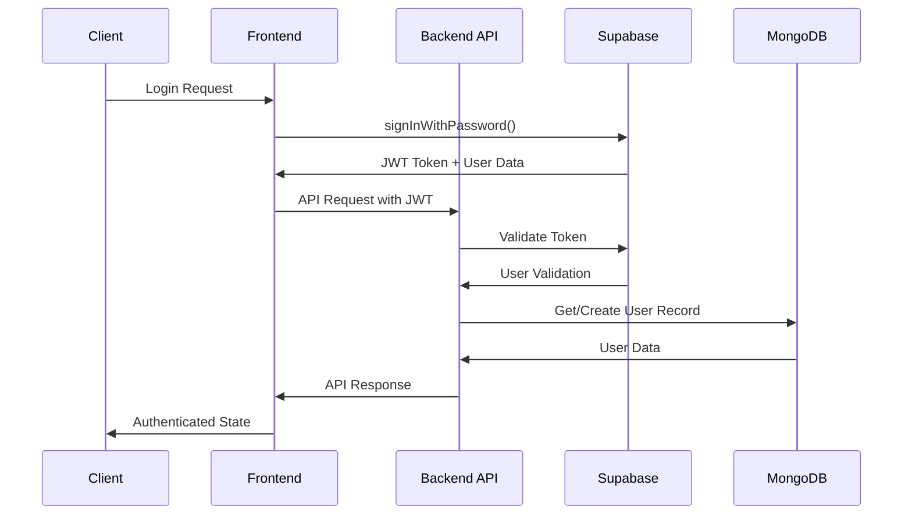

# Supabase Integration Guide

## Overview

Supabase serves as the authentication and user management backbone for the Restaurant Developer platform. It provides secure, scalable authentication services while integrating seamlessly with our MongoDB data layer for optimal performance.

### Purpose and Role
- **Primary Authentication Provider**: Handles user signup, login, and session management
- **JWT Token Management**: Provides secure tokens for API authentication
- **User Profile Storage**: Manages basic user information and metadata
- **Role-Based Access Control**: Supports restaurant owner and customer roles
- **Email Verification**: Handles email confirmation workflows

### Key Features Utilized
- Email/Password authentication
- JWT token generation and validation
- User metadata storage
- Row-level security policies
- Real-time subscriptions (for future features)
- Password reset functionality

### Integration Points
- **Backend API**: JWT validation middleware
- **MongoDB**: User data synchronization
- **Frontend**: Authentication state management
- **Role Management**: Restaurant owner permissions

## Setup & Configuration

### Environment Variables

```bash
# Supabase Configuration
SUPABASE_URL=https://your-project.supabase.co
SUPABASE_ANON_KEY=your-anon-key
SUPABASE_SERVICE_ROLE_KEY=your-service-role-key

# Optional: Custom JWT Secret (if using custom JWT)
JWT_SECRET=your-custom-jwt-secret
JWT_EXPIRES_IN=24h
```

### Initial Setup Steps

#### 1. Create Supabase Project
```bash
# Visit https://supabase.com and create a new project
# Note down your project URL and API keys
```

#### 2. Configure Authentication Settings
```sql
-- Enable email confirmation (optional but recommended)
-- In Supabase Dashboard > Authentication > Settings
-- Set "Enable email confirmations" to true
-- Configure email templates as needed
```

#### 3. Set Up User Metadata Schema
```sql
-- Custom user fields in auth.users metadata
-- Example metadata structure:
{
  "role": "restaurant_owner",
  "restaurant_id": "uuid-here",
  "name": "John Doe"
}
```

### Development vs Production Configuration

#### Development Setup
```javascript
// backend/config/supabase.js
const { createClient } = require('@supabase/supabase-js');

const supabaseUrl = process.env.SUPABASE_URL;
const supabaseKey = process.env.SUPABASE_ANON_KEY;

const supabase = createClient(supabaseUrl, supabaseKey);

module.exports = supabase;
```

#### Production Setup
```javascript
// Enhanced configuration with service role key for admin operations
const supabaseAdmin = createClient(
  process.env.SUPABASE_URL,
  process.env.SUPABASE_SERVICE_ROLE_KEY,
  {
    auth: {
      autoRefreshToken: false,
      persistSession: false
    }
  }
);
```

## API Reference

### Authentication Endpoints

#### User Signup
```javascript
// POST /auth/signup
const { data, error } = await supabase.auth.signUp({
  email: 'user@example.com',
  password: 'securepassword',
  options: {
    data: {
      name: 'John Doe',
      role: 'restaurant_owner'
    }
  }
});

// Response
{
  user: {
    id: 'uuid',
    email: 'user@example.com',
    user_metadata: {
      name: 'John Doe',
      role: 'restaurant_owner'
    }
  },
  session: {
    access_token: 'jwt-token',
    refresh_token: 'refresh-token'
  }
}
```

#### User Login
```javascript
// POST /auth/login
const { data, error } = await supabase.auth.signInWithPassword({
  email: 'user@example.com',
  password: 'securepassword'
});

// Response includes user object and session tokens
```

#### Token Validation
```javascript
// Middleware for validating JWT tokens
const jwt = require('jsonwebtoken');

const validateSupabaseToken = async (req, res, next) => {
  try {
    const token = req.headers.authorization?.replace('Bearer ', '');
    
    if (!token) {
      return res.status(401).json({ error: 'No token provided' });
    }

    // Verify with Supabase
    const { data: { user }, error } = await supabase.auth.getUser(token);
    
    if (error || !user) {
      return res.status(401).json({ error: 'Invalid token' });
    }

    req.user = user;
    next();
  } catch (error) {
    res.status(401).json({ error: 'Token validation failed' });
  }
};
```

### User Management

#### Get User Profile
```javascript
// GET /auth/profile
const getUserProfile = async (userId) => {
  const { data, error } = await supabase.auth.admin.getUserById(userId);
  return { data, error };
};
```

#### Update User Metadata
```javascript
// PATCH /auth/profile
const updateUserProfile = async (userId, updates) => {
  const { data, error } = await supabase.auth.admin.updateUserById(
    userId,
    { user_metadata: updates }
  );
  return { data, error };
};
```

### Error Handling Patterns

```javascript
// Common error handling for Supabase operations
const handleSupabaseError = (error) => {
  console.error('Supabase error:', error);
  
  switch (error.message) {
    case 'Invalid login credentials':
      return { status: 401, message: 'Invalid email or password' };
    case 'Email not confirmed':
      return { status: 400, message: 'Please verify your email address' };
    case 'User already registered':
      return { status: 409, message: 'User already exists' };
    default:
      return { status: 500, message: 'Authentication error occurred' };
  }
};
```

## Implementation Examples

### Backend Authentication Middleware

```javascript
// backend/middleware/auth.js
const supabase = require('../config/supabase');
const User = require('../models/User');

const authenticateUser = async (req, res, next) => {
  try {
    const authHeader = req.headers.authorization;
    
    if (!authHeader || !authHeader.startsWith('Bearer ')) {
      return res.status(401).json({ error: 'Authorization header required' });
    }

    const token = authHeader.substring(7);
    
    // Validate token with Supabase
    const { data: { user }, error } = await supabase.auth.getUser(token);
    
    if (error || !user) {
      return res.status(401).json({ error: 'Invalid or expired token' });
    }

    // Get cached user data from MongoDB
    const mongoUser = await User.findOne({ supabase_id: user.id });
    
    if (!mongoUser) {
      // Create user in MongoDB if doesn't exist
      const newUser = new User({
        supabase_id: user.id,
        email: user.email,
        name: user.user_metadata?.name,
        role: user.user_metadata?.role || 'restaurant_owner'
      });
      await newUser.save();
      req.user = newUser;
    } else {
      req.user = mongoUser;
    }

    next();
  } catch (error) {
    console.error('Authentication error:', error);
    res.status(500).json({ error: 'Authentication failed' });
  }
};

module.exports = { authenticateUser };
```

### Frontend Authentication Hook

```javascript
// frontend/hooks/useAuth.js
import { useState, useEffect, createContext, useContext } from 'react';
import { supabase } from '../lib/supabase';

const AuthContext = createContext();

export const useAuth = () => {
  const context = useContext(AuthContext);
  if (!context) {
    throw new Error('useAuth must be used within AuthProvider');
  }
  return context;
};

export const AuthProvider = ({ children }) => {
  const [user, setUser] = useState(null);
  const [loading, setLoading] = useState(true);

  useEffect(() => {
    // Get initial session
    const getInitialSession = async () => {
      const { data: { session } } = await supabase.auth.getSession();
      setUser(session?.user ?? null);
      setLoading(false);
    };

    getInitialSession();

    // Listen for auth changes
    const { data: { subscription } } = supabase.auth.onAuthStateChange(
      async (event, session) => {
        setUser(session?.user ?? null);
        setLoading(false);
      }
    );

    return () => subscription.unsubscribe();
  }, []);

  const signUp = async (email, password, userData) => {
    const { data, error } = await supabase.auth.signUp({
      email,
      password,
      options: {
        data: userData
      }
    });
    return { data, error };
  };

  const signIn = async (email, password) => {
    const { data, error } = await supabase.auth.signInWithPassword({
      email,
      password
    });
    return { data, error };
  };

  const signOut = async () => {
    const { error } = await supabase.auth.signOut();
    return { error };
  };

  const value = {
    user,
    loading,
    signUp,
    signIn,
    signOut
  };

  return (
    <AuthContext.Provider value={value}>
      {children}
    </AuthContext.Provider>
  );
};
```

### User Registration Flow

```javascript
// backend/routes/auth.js
const express = require('express');
const supabase = require('../config/supabase');
const User = require('../models/User');
const router = express.Router();

// POST /auth/signup
router.post('/signup', async (req, res) => {
  try {
    const { email, password, name } = req.body;
    
    // Create user in Supabase
    const { data, error } = await supabase.auth.admin.createUser({
      email,
      password,
      user_metadata: {
        name,
        role: 'restaurant_owner'
      },
      email_confirm: true // Skip email confirmation in development
    });

    if (error) {
      return res.status(400).json({ error: error.message });
    }

    // Create user record in MongoDB
    const mongoUser = new User({
      supabase_id: data.user.id,
      email: data.user.email,
      name,
      role: 'restaurant_owner'
    });

    await mongoUser.save();

    res.status(201).json({
      message: 'User created successfully',
      user: {
        id: data.user.id,
        email: data.user.email,
        name,
        role: 'restaurant_owner'
      }
    });
  } catch (error) {
    console.error('Signup error:', error);
    res.status(500).json({ error: 'User creation failed' });
  }
});

module.exports = router;
```

## Integration with Restaurant Developer

### Data Flow Architecture



### User Data Synchronization

```javascript
// Sync user data between Supabase and MongoDB
const syncUserData = async (supabaseUser) => {
  try {
    let mongoUser = await User.findOne({ supabase_id: supabaseUser.id });
    
    if (!mongoUser) {
      // Create new user in MongoDB
      mongoUser = new User({
        supabase_id: supabaseUser.id,
        email: supabaseUser.email,
        name: supabaseUser.user_metadata?.name,
        role: supabaseUser.user_metadata?.role || 'restaurant_owner',
        last_sync: new Date()
      });
    } else {
      // Update existing user data
      mongoUser.email = supabaseUser.email;
      mongoUser.name = supabaseUser.user_metadata?.name || mongoUser.name;
      mongoUser.last_sync = new Date();
    }
    
    await mongoUser.save();
    return mongoUser;
  } catch (error) {
    console.error('User sync error:', error);
    throw error;
  }
};
```

### Performance Considerations

#### Caching Strategy
```javascript
// Cache user data in MongoDB to reduce Supabase calls
const getUserFromCache = async (supabaseId) => {
  const cacheExpiry = 5 * 60 * 1000; // 5 minutes
  
  const user = await User.findOne({ supabase_id: supabaseId });
  
  if (user && (Date.now() - user.last_sync.getTime()) < cacheExpiry) {
    return user; // Return cached data
  }
  
  // Refresh from Supabase if cache is stale
  const { data: supabaseUser } = await supabase.auth.admin.getUserById(supabaseId);
  return await syncUserData(supabaseUser);
};
```

#### Connection Pooling
```javascript
// Optimize Supabase client connections
const supabaseConfig = {
  auth: {
    autoRefreshToken: true,
    persistSession: true,
    detectSessionInUrl: false
  },
  global: {
    headers: {
      'x-application-name': 'restaurant-developer'
    }
  }
};
```

## Troubleshooting

### Common Issues and Solutions

#### Issue: "Invalid JWT Token"
```javascript
// Solution: Check token format and expiration
const debugToken = (token) => {
  try {
    const decoded = jwt.decode(token, { complete: true });
    console.log('Token header:', decoded.header);
    console.log('Token payload:', decoded.payload);
    console.log('Token expires:', new Date(decoded.payload.exp * 1000));
    return decoded;
  } catch (error) {
    console.error('Token decode error:', error);
  }
};
```

#### Issue: "User not found in MongoDB"
```javascript
// Solution: Implement user creation fallback
const ensureUserExists = async (supabaseUser) => {
  let user = await User.findOne({ supabase_id: supabaseUser.id });
  
  if (!user) {
    console.log('Creating missing user in MongoDB:', supabaseUser.id);
    user = await syncUserData(supabaseUser);
  }
  
  return user;
};
```

#### Issue: "Email confirmation required"
```javascript
// Solution: Handle email confirmation flow
const handleEmailConfirmation = async (req, res) => {
  const { token, type } = req.query;
  
  if (type === 'signup') {
    const { error } = await supabase.auth.verifyOtp({
      token_hash: token,
      type: 'signup'
    });
    
    if (error) {
      return res.redirect('/auth/error?message=confirmation_failed');
    }
    
    res.redirect('/auth/confirmed');
  }
};
```

### Debugging Techniques

#### Enable Debug Logging
```javascript
// Add debug logging for Supabase operations
const supabaseWithLogging = {
  ...supabase,
  auth: {
    ...supabase.auth,
    signInWithPassword: async (credentials) => {
      console.log('Attempting login for:', credentials.email);
      const result = await supabase.auth.signInWithPassword(credentials);
      console.log('Login result:', result.error ? 'FAILED' : 'SUCCESS');
      return result;
    }
  }
};
```

#### Monitor Authentication Events
```javascript
// Track authentication events for debugging
supabase.auth.onAuthStateChange((event, session) => {
  console.log('Auth event:', event, {
    user_id: session?.user?.id,
    expires_at: session?.expires_at
  });
  
  // Log to Winston for production monitoring
  logger.info('Authentication event', {
    event,
    user_id: session?.user?.id,
    timestamp: new Date().toISOString()
  });
});
```

### Monitoring and Logging

```javascript
// Winston logging integration for Supabase events
const winston = require('winston');

const logger = winston.createLogger({
  level: 'info',
  format: winston.format.combine(
    winston.format.timestamp(),
    winston.format.json()
  ),
  transports: [
    new winston.transports.File({ 
      filename: 'logs/auth.log',
      level: 'info'
    })
  ]
});

// Log authentication events
const logAuthEvent = (event, user, additional = {}) => {
  logger.info('Supabase auth event', {
    event,
    user_id: user?.id,
    email: user?.email,
    role: user?.user_metadata?.role,
    ...additional,
    timestamp: new Date().toISOString()
  });
};
```

## Resources

### Official Documentation
- [Supabase Documentation](https://supabase.com/docs)
- [Supabase Auth Guide](https://supabase.com/docs/guides/auth)
- [JavaScript Client Library](https://supabase.com/docs/reference/javascript)
- [Row Level Security](https://supabase.com/docs/guides/auth/row-level-security)

### Best Practices
- [Supabase Security Best Practices](https://supabase.com/docs/guides/auth/auth-helpers/nextjs)
- [JWT Token Management](https://supabase.com/docs/guides/auth/auth-helpers/auth-ui)
- [Production Deployment Guide](https://supabase.com/docs/guides/platform/going-into-prod)

### Community Resources
- [Supabase Community Forum](https://github.com/supabase/supabase/discussions)
- [Supabase Discord](https://discord.supabase.com/)
- [Stack Overflow - Supabase Tag](https://stackoverflow.com/questions/tagged/supabase)

### Migration Guides
- [Firebase to Supabase Migration](https://supabase.com/docs/guides/migrations/firebase-auth)
- [Auth0 to Supabase Migration](https://supabase.com/docs/guides/migrations/auth0)
- [Scaling Authentication](https://supabase.com/docs/guides/auth/auth-helpers)

---

*Last Updated: January 2025*
*Version: 1.0.0* 